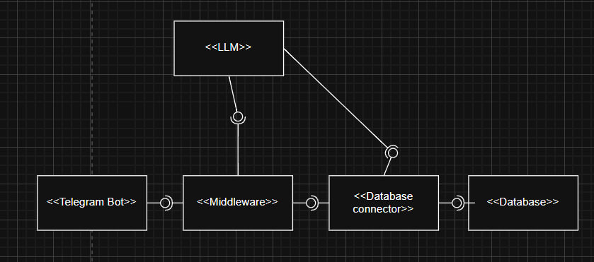

# Architecture

## Static view

**Cohesion**

- Telegram Bot is responsible only for receiving and sending messages to the user.

- Middleware handles the processing and routing of requests between components.

- The Database Connector implements all the logic of accessing the database.

- LLM is solely responsible for generating responses based on the received data.

- The database stores all the necessary information and query history.

**Coupling**

- Telegram Bot does not interact directly with either the LLM or the database — it only works with Middleware.

- Middleware acts as the central link, receiving requests from the bot, accessing the database through the Database Connector and interacting with the LLM to receive a response.

**Maintainability of our product**

1) Using a separate connector for working with the database and weak component interdependence (low coupling) make it easy to update or replace the database without significant changes to the rest of the system.

2) The Telegram Bot component can be removed, and the same business logic can be embedded directly into the customer's existing application without significant rework.

## Deployment view

Our server system is deployed on the Railway server.

To simplify integration with the customer's application, we provide documented API endpoints. The client can connect directly to these endpoints from their own application, making it easier to implement our server functions without having to change the existing interface or infrastructure.

**Deployment Highlights:**

**Server:** Railway _(cloud server)_

**Integration:** The customer is provided with secure API endpoints to connect his application to our server.

## Dynamic view

**Average system response time based on test results in a production environment:**

- The bot's response: less than 1 second.

- LLM's answer: about 3 seconds on average.
